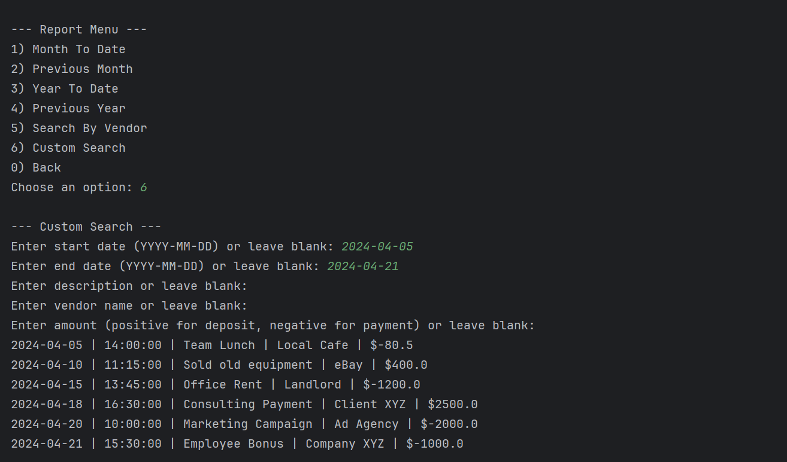

# 📒 LedgerApp - Simple Java Financial Tracker

This is a simple **Java console application** that helps users manage financial transactions.  
Users can add deposits and payments, view all transactions, and generate reports for specific time periods like **month-to-date** or **year-to-date**.

---

## 📋 Features

- Add deposits and payments (debits)
- View all transactions
- View only deposits or payments
- Generate reports for **month-to-date**, **previous month**, **year-to-date**, and **previous year**
- Search transactions by **vendor**
- **Custom search** by **date range**, **description**, **vendor**, and **amount**
- **Edit or delete transactions**
- **Summary report** of total deposits, payments, and current balance

---

## 🌟 Extra Features

In addition to the core functionality, the **Ledger App** includes the following extra features that enhance the user experience:

- **Transaction Editing**: Users can **edit** the details of an existing transaction, such as the description, vendor, and amount.
- **Transaction Deletion**: Users can **delete** transactions from the records.
- **Save All Transactions**: After editing or deleting a transaction, all changes are saved to the CSV file automatically.
- **Advanced Custom Search**: Offers **dynamic filtering** for transactions based on **multiple criteria** including date ranges, description, vendor, and amount.
- **Dynamic Date Filtering for Reports**: Generate reports such as **Month-To-Date**, **Previous Month**, and **Year-To-Date** by dynamically filtering transactions based on the user’s selected date range.
- **Summary Report**: Provides a **summary** of total deposits, total payments, and the **current balance** for a quick overview of financials.

---

## 🛠️ Technologies Used

- **Java (JDK 8+)** for the core logic.
- **File I/O** (`BufferedReader`, `BufferedWriter`) for transaction persistence.
- **LocalDate** and **LocalDateTime** for handling date and time.
- **Scanner-based navigation** for user interaction.

---

## 📂 Project Structure

---

## 📸 Screenshots

### 🏠 Main Menu


### 💵 Add Deposit 


### 💵 Make Payment


### 📒 Ledger Screen –> View All Transactions


### 📊 Report Screen – > Summary Report


### 📝 Edit/Delete Transaction


### 🔍 Custom Search Screen



---

## 💬 Interesting Piece of Code

One important part of the project is how transactions are saved to the CSV file. This is handled by the following method, which appends the current transaction’s details—including date, time, description, vendor, and amount—to the file in a structured format.


```java
private static void saveTransaction() {
    try {
        // Open the CSV file for appending
        BufferedWriter writer = new BufferedWriter(new FileWriter(FILE_NAME, true));

        // Write the transaction details to the CSV file
        writer.write(currentTransaction.getDate() + "|" + currentTransaction.getTime() + "|" +
                currentTransaction.getDescription() + "|" + currentTransaction.getVendor() + "|" +
                currentTransaction.getAmount());
        writer.newLine();  // Add a new line after each transaction
        writer.close();  // Close the writer to save changes
        System.out.println("Transaction saved successfully!");
    } catch (IOException e) {
        System.out.println("Error saving transaction: " + e.getMessage());
    }
}
```
## 🏆 Author

- **Thierno Diallo**